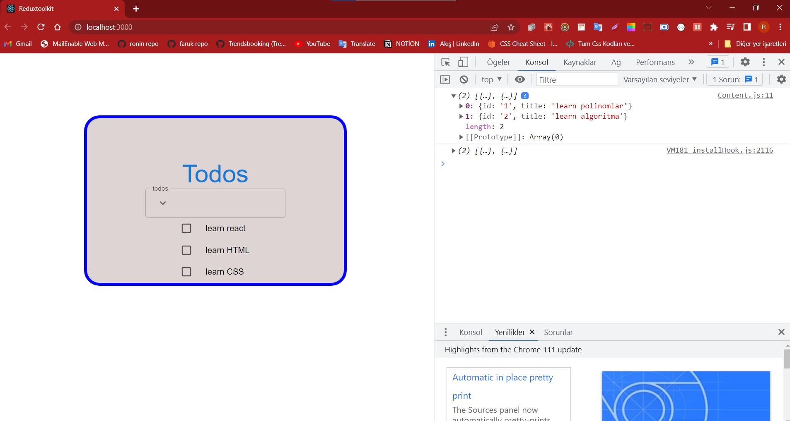

# reduxtoolkit

```
npx create-react-app .
```

```
yarn add @reduxjs/toolkit react-redux
```

# src/redux/store.js

```
import { configureStore } from '@reduxjs/toolkit'

export const store = configureStore({
  reducer: {},
})
```

# index.js

```
import React from 'react';
import ReactDOM from 'react-dom/client';
import './index.css';
import App from './App';
import {store} from './redux/store';
import {Provider} from 'react-redux';


const root = ReactDOM.createRoot(document.getElementById('root'));
root.render(
  <React.StrictMode>
    <Provider store={store}>
    <App />
    </Provider>
  </React.StrictMode>
);

```

# redux/todos/todosSlice.js

```
import { createSlice } from "@reduxjs/toolkit";


export const todosSlice = createSlice({
    name: "todos",
    initialState:{
        items:[]
    },
    reducers:{},
})

```

yukarıdaki kodta neler yaptık:
Redux Toolkit kütüphanesi kullanılarak bir todosSlice adında bir Redux slice oluşturduk.

Bir slice, Redux mağazasında belirli bir durumu ve o durumla ilgili işlemleri yöneten bir parçadır.

createSlice fonksiyonu, bir slice oluşturmak için kullanılır ve bir obje döndürür. Bu obje, slice'ın durumunu ve durumla ilgili işlemleri tanımlayan reducer'ları içerir.

todosSlice objesi şu özellikleri içerir:

name: slice'ın adı. Bu, Redux Toolkit tarafından kullanılmaz ve sadece slice'ı tanımlamak için kullanılır.
initialState: slice'ın başlangıç durumu. Burada, slice'ın sadece bir öğeler dizisi içerdiği boş bir durum tanımlanmıştır.
reducers: slice'ın işlemlerini tanımlayan bir nesne. Henuz bir işlem tanımlamadık.
Bu örnek kod, henüz herhangi bir işlevsellik eklemeyen temel bir slice tanımlamak için kullanılabilir. Daha sonra, reducers nesnesi içindeki fonksiyonlar, slice'ın durumunu güncellemek için kullanılabilir.

# redux/todos/todosSlice.js

```
import { createSlice } from "@reduxjs/toolkit";


export const todosSlice = createSlice({
    name: "todos",
    initialState:{
        items:[]
    },
    reducers:{},
});

export default todosSlice.reducer;
```

```
export default todosSlice.reducer;
```

komutu ile <todosSlice> ın reducer ını dışa aktarmış oldum.
bunu

Bu kod, Redux Toolkit'in createSlice fonksiyonunu kullanarak bir todos slice'ı oluşturur. Bu slice, Redux store'unda state yönetimi için kullanılır.

createSlice fonksiyonu, bir slice için bir isim ve bir başlangıç durumu belirtir. Bu slice içindeki veriler, slice adına özgü eylemler tarafından değiştirilebilir.

Bu örnekte, todos slice'ı, boş bir dizi (items: []) ile başlatılır. Ancak, slice için eylemler tanımlanmamıştır (reducers: {}). Eylemler, slice içindeki state'i değiştirmek için kullanılabilir.

En son olarak, todosSlice.reducer export edilir. Bu, slice'ın reducer fonksiyonunu export eder ve Redux store'unun state yönetiminde kullanılabilir.

# src/redux/store.js burada kullanacağım şöyleki;

```
import { configureStore } from '@reduxjs/toolkit'
import todosSlice from './todos/todosSlice'


export const store = configureStore({
  reducer: {
    todos: todosSlice,
  },
})
```

Bu kod, Redux Toolkit'in configureStore fonksiyonunu kullanarak bir Redux store oluşturur.

configureStore fonksiyonu, Redux store için ayarları yapılandırmak ve gerekli middleware'leri eklemek için kullanılır. Bu örnekte, reducer özelliği kullanılarak, store'a todos slice'ı eklenir.

todosSlice burada bir reducer fonksiyonudur ve slice'ın state yönetimini gerçekleştirir. reducer özelliğine eklemek, todosSlice'ın store'daki ilgili slice ile bağdaştırılmasını sağlar.

Sonuç olarak, store değişkeni, configureStore fonksiyonundan dönen bir Redux store nesnesidir. Bu store, uygulamanın herhangi bir yerinde kullanılabilir ve todos slice'ındaki state yönetimi için kullanılabilir.

şimdi ben gitip her hangi bir componentte bu initial stateteki verileri kullanayım.

```
import { createSlice } from "@reduxjs/toolkit";


export const todosSlice = createSlice({
    name: "todos",
    initialState:{
        items:[]
    },
    reducers:{},
});

export default todosSlice.reducer;
```

buraya erişebiliyormuyum görmem lazım
be bu listelemeıyi nered yapacağım hangi komponentte yapacağım.Content.js içerisinde yapacağım
tanımlamış olduğum bir state erişim sağlayabilmek için
<react-redux> altındaki <useSelector> ismindeki hookunda kullanmam gerekecek. birde yazmış olduğum Slice i içeriye alacağım bunu niçin alıyorum bir even dispach edeceğim zaman kullanacağım için
şimdi

# component/Content.js

içerisine

```
import { useSelector } from "react-redux";

```

import edelim.ve

```
const items = useSelector(state=>state.todos.items);
  console.log(items)
```

Bu kod, React uygulamasında Redux store'daki todos slice'ındaki items state'ini seçmek için useSelector hooks'unu kullanır.

useSelector hooks'u, Redux store'daki belirli bir state'i seçmek için kullanılır. Hooks'a bir fonksiyon geçilir ve bu fonksiyon, seçilen state'in kullanılacağı React bileşenindeki props gibi bir argüman olarak kullanılır.

Burada, fonksiyon, state argümanını alır ve state.todos.items özelliğini seçer. Yani items değişkeni, Redux store'daki todos slice'ındaki items state'ini seçer.

Sonrasında, seçilen items değişkeni console.log() fonksiyonuyla konsola yazdırılır. Bu, items değişkeninin store'da bulunan değerini görmenizi sağlar.

# component/Content.js

```
import React from "react";
import FormControlLabel from "@mui/material/FormControlLabel";
import Checkbox from "@mui/material/Checkbox";
import Typography from "@mui/material/Typography";
import { Box } from "@mui/material";

import { useSelector } from "react-redux";

const Content = () => {
  const items = useSelector(state=>state.todos.items);
  console.log(items)
  return (
    <>
    <Box sx={{
        display:"flex",
        flexDirection: "column",
        justifyContent:"space-between",
        alignItems:"flex-start",
    }}>


      <Box
        sx={{
          display: "flex",
          justifyContent: "center",
          alignItems: "center",
        }}
      >
        <FormControlLabel label="" control={<Checkbox color="primary" />} />
        <Typography variant="body1" color="initial">
          learn react
        </Typography>
      </Box>
      <Box
        sx={{
          display: "flex",
          justifyContent: "center",
          alignItems: "center",
        }}
      >
        <FormControlLabel label="" control={<Checkbox color="primary" />} />
        <Typography variant="body1" color="initial">
         learn HTML
        </Typography>
      </Box>
      <Box
        sx={{
          display: "flex",
          justifyContent: "center",
          alignItems: "center",
        }}
      >
        <FormControlLabel label="" control={<Checkbox color="primary" />} />
        <Typography variant="body1" color="initial">
            learn CSS
        </Typography>
      </Box>
      </Box>
    </>
  );
};

export default Content;
```

bunu denemek için

# redux/todos/todosSlice.js

initial stateleri giriyorum

```
import { createSlice } from "@reduxjs/toolkit";

export const todosSlice = createSlice({
  name: "todos",
  initialState: {
    items: [
      {
        id: "1",
        title: "learn polinomlar",
      },
      {
        id: "2",
        title: "learn algoritma",
      },
    ],
  },
  reducers: {},
});

export default todosSlice.reducer;
```



girdiğimiz initial stateleri konsolda gördük.
artık ben bunları ekrana yazdırabilirim

# component/Content.js

şu şekilde değiştiriyorum.

```

import React from "react";
import FormControlLabel from "@mui/material/FormControlLabel";
import Checkbox from "@mui/material/Checkbox";
import Typography from "@mui/material/Typography";
import { Box } from "@mui/material";

import { useSelector } from "react-redux";

const Content = () => {
  const items = useSelector((state) => state.todos.items);
  console.log(items);
  return (
    <>
      <Box
        sx={{
          display: "flex",
          flexDirection: "column",
          justifyContent: "space-between",
          alignItems: "flex-start",
        }}
      >
        {items.map((item, index) => (
          <Box
            key={index}
            sx={{
              display: "flex",
              justifyContent: "center",
              alignItems: "center",
            }}
          >
            <FormControlLabel label="" control={<Checkbox color="primary" />} />
            <Typography variant="body1" color="initial">
              {index + 1} - {item.title}
            </Typography>
          </Box>
        ))}
      </Box>
    </>
  );
};

export default Content;


```

>Bu bileşen, useSelector hooks'unu kullanarak Redux store'dan todos slice'ındaki items state'ini seçer ve her bir öğeyi checkbox ve metin etiketi ile birlikte görüntüler.

>Box bileşeni, MUI kütüphanesinden ithal edilir ve sayfada düzenleme için kullanılır. Box bileşeni, Flexbox özellikleri ile birlikte gelir.

>Bileşen, items.map() fonksiyonunu kullanarak items dizisindeki her bir öğeyi render eder. Her öğe, bir FormControlLabel bileşeni içinde bir Checkbox ve bir Typography etiketi ile sarılır.

>Typography bileşeni, MUI kütüphanesinden gelen bir bileşendir ve metinleri düzenlemek için kullanılır. Burada, item.id ve item.title özellikleri Typography etiketi içinde görüntülenir.

>Sonuç olarak, Content bileşeni, items dizisindeki öğeleri checkbox ve metin etiketiyle görüntüler ve kullanıcının bu öğeleri seçmesine olanak tanır.

>bu noktada map() fonksiyonundan mahsetmek istiyorum.

>map() fonksiyonunun ikinci parametresi olan index, döngü içinde bulunan öğenin dizindeki sırasını belirtir. Yani, items dizisindeki her bir öğenin kaçıncı sırada olduğunu temsil eder.

>Bu parametre, özellikle React bileşenlerinde birden çok öğe render etmek için key prop'unu belirlemek için kullanılır. key prop, React tarafından her bir öğenin benzersiz bir şekilde tanımlanması için gereklidir ve performansı artırmak için kullanılır.

>Örneğin, key prop'u, items.map() fonksiyonunun döndürdüğü bileşenlerin her birine atanabilir:

```
{items.map((item, index) => (
  <Box key={index}>
    ...
  </Box>
))}

```

Ancak, key olarak index kullanmak, performans sorunlarına neden olabileceğinden pek önerilmez. Eğer items dizisindeki öğelerin kendileri benzersiz bir özellikleri yoksa, bir benzersiz kimlik değeri verilmesi daha uygun olacaktır.

buraya kadar yapılanları özetleyelim:

Baştan başlayalım, böylece bütün dersleri pekiştiririz. Kafanızı karıştıracak bir nokta olmasını istemiyorum, o yüzden bu derste yaptığımız şeyleri açıklayayım. İlk olarak,

```
yarn add @reduxjs/toolkit react-redux
```
komutu ile işe koyulduk ve ardından src/redux/store.js dosyasının içinde store ımızı luşturduk. index.js içerisinde bir "provider" (sağlayıcı) tanımlaması yaparak store parametre olarak geçtik ve <App/>imizi <Provider> ile sarmalladık. sonra bir slice ihtiyacımız vardı.
onuda src/redux/todos/todosSlice.js dosyasının içesinde ouşturduk todos la alakalı elemanları tutabileceğimiz.reducerlarımızı yazabileceğimiz bir slice oluşturmamız gerekiyor.

````
import { createSlice } from "@reduxjs/toolkit";
```` 
bunu kullanarak

üç farrlı key ile 
````
export const todosSlice = createSlice({
  name: "todos",
  initialState: {
    items: [
      {
        id: "1",
        title: "learn polinomlar",
      },
      {
        id: "2",
        title: "learn algoritma",
      },
    ],
  },
  reducers: {},
});

export default todosSlice.reducer;
```` 
bunları oluşturduk

bunları kullanırkende <useSelector> isimli hook u kullandık

# yeni todo elemanı eklemek


şimdide input umuzu kullanarak başka kayıtlar yapmaya çalişalım.
 form submit edildiği anda eklenmesini bekliyoruz.
 reducer kısmında yeni bir tanım yapacağız.burada yazacağımız fonsiyonuda gidip Form.js form componentinde kullanacağız.dispatch ederek kullanacağız.

 # redux/todos/todosSlice.js
 ````
 import { createSlice } from "@reduxjs/toolkit";

export const todosSlice = createSlice({
  name: "todos",
  initialState: {
    items: [
      {
        id: "1",
        title: "learn polinomlar",
      },
      {
        id: "2",
        title: "learn algoritma",
      },
    ],
  },
  reducers: {
    addTodo: (state, action) => {
      state.items.push(action.payload);
    },
  },
});

export const {addTodo} = todosSlice.actions;

export default todosSlice.reducer;
````

bu slice ta bir addTodo adındabir reducer tanımdık. burada"addTodo" eylemi tanımlanmıştır. Bu eylem, state içindeki "items" dizisine bir öğe ekler.

Son olarak, todosSlice.actions nesnesi, slice için tanımlanmış olan eylemleri içerir. Burada, sadece "addTodo" eylemi tanımlanmıştır.

Bu slice, birçok parçadan oluşan bir Redux mağazasında kullanılabilir. "addTodo" eylemi çağrıldığında, state içindeki "items" dizisi güncellenir ve yeni bir öğe eklenir.
# components/Form.js
````
import { TextField, InputAdornment, IconButton, Box } from "@mui/material";
import { Search } from "@mui/icons-material";
import KeyboardArrowDownIcon from "@mui/icons-material/KeyboardArrowDown";
import React,{useState} from "react";
import { useDispatch } from "react-redux";
import { addTodo } from "../redux/todos/todosSlice";
import { nanoid } from "@reduxjs/toolkit";

const Form = () => {
  const [title, setTitle] = useState('')
  console.log(title)

  const dispatch = useDispatch();


  const handleSubmit = (e) => {
    e.preventDefault();
    dispatch(addTodo({ id: nanoid(), title, completed: false }))
    setTitle('');
  };
  return (
   

    <>
      <form onSubmit={handleSubmit}>
      <TextField
     
        id="input-with-icon-textfield"
        label="todos"
        value={title}
        onChange={(e)=>setTitle(e.target.value)}
        placeholder="what needs to be done"
        InputProps={{
          startAdornment: (
            <InputAdornment position="start">
              <IconButton>
                <KeyboardArrowDownIcon />
              </IconButton>
            </InputAdornment>
          ),
        }}
      />
      </form>
    </>
  );
};

export default Form;
````
Bu kod, MUI TextField bileşenini kullanarak bir form oluşturur. Bu form, yeni bir todo öğesi eklemek için kullanılır.

Form bileşeni, useState hook'unu kullanarak bir title adında bir değişken oluşturur. Bu değişken, kullanıcının girdiği todo öğesinin başlığını tutar. console.log fonksiyonu, title değişkeninin değerini konsolda görüntüler.

Form bileşeni, useDispatch hook'unu kullanarak dispatch adında bir değişken oluşturur. Bu değişken, Redux mağazasındaki addTodo işlevini çağırmak için kullanılır.

handleSubmit fonksiyonu, form gönderildiğinde çağrılır. Bu fonksiyon, addTodo işlevini kullanarak yeni bir todo öğesi ekler. Bu işlem, title değişkeninin değerini kullanır ve tamamlanmamış olarak ayarlanan bir rastgele id değeri oluşturur. Son olarak, title değişkeninin değeri temizlenir ve kullanıcıya yeni bir todo öğesi eklemek için hazır bir form gösterilir.

TextField bileşeni, kullanıcıdan todo öğesi başlığı girmesini bekler ve bu girdiyi title değişkenine aktarır. Ayrıca, InputAdornment ve IconButton bileşenlerini kullanarak açılır menüyü ve ok simgesini görüntüler.

Bu bileşen, uygulamanın geri kalanında kullanılabilir ve yeni todo öğeleri eklemek için kullanılabilir.
# Toggle İşlemlerinin Yapılması
bir item ı tamamlandı olarak nasıl işaretleriz ona bakacağız
toggle active se de active de active ise active şeklinde birşey..
o zaman slice ımıza gidelim yeni bir reducer ekleyelim

 # redux/todos/todosSlice.js

 ````
 import { createSlice } from "@reduxjs/toolkit";

export const todosSlice = createSlice({
  name: "todos",
  initialState: {
    items: [
      {
        id: "1",
        title: "learn polinomlar",
        completed: false,
      },
      {
        id: "2",
        title: "learn algoritma",
        completed: false,
      },
    ],
  },
  reducers: {
    addTodo: (state, action) => {
      state.items.push(action.payload);
    },
    toggle: (state, action) => {
      const { id } = action.payload;
      const item = state.items.find((item) => item.id === id);
      item.completed = !item.completed;
    },
  },
});

export const { addTodo, toggle } = todosSlice.actions;

export default todosSlice.reducer;
````
toggle action türü: Bu action, bir todo öğesinin tamamlanma durumunu değiştirmek için kullanılır. action.payload üzerinden değiştirilmek istenen todo öğesinin id değerine erişilir. state.items dizisinde, find() metodunu kullanarak ilgili todo öğesini buluruz. Ardından, todo öğesinin completed (tamamlanma durumu) alanını tersine çevirerek tamamlanma durumunu değiştiririz. Böylece, ilgili todo öğesinin tamamlanma durumu güncellenmiş olur.

# src/components/Content.js
````
import React from "react";

import Checkbox from "@mui/material/Checkbox";
import Typography from "@mui/material/Typography";
import { Box } from "@mui/material";
import { useSelector, useDispatch } from "react-redux";
import { toggle } from "../redux/todos/todosSlice";

const Content = () => {
  const dispatch = useDispatch();
  const items = useSelector((state) => state.todos.items);

  const handleCheckboxChange = (id) => {
    dispatch(toggle({ id }));
  };

  return (
    <>
      {items.map((item, index) => (
        <Box
          key={item.id}
          sx={{
            display: "flex",
            justifyContent: "center",
            alignItems: "center",
          }}
        >
          <Checkbox
            checked={item.completed}
            onChange={() => handleCheckboxChange(item.id)}
            inputProps={{
              "aria-label": "controlled",
            }}
          />

          <Typography
            variant="body1"
            color="initial"
            sx={{
              textDecoration: item.completed ? "line-through" : "none",
            }}
          >
            {index + 1} - {item.title}
          </Typography>
        </Box>
      ))}
    </>
  );
};

export default Content;
````

# silme işlemleri

öncelikle slice ımızı tanımladık
 # redux/todos/todosSlice.js

 
````
import { createSlice } from "@reduxjs/toolkit";

export const todosSlice = createSlice({
  name: "todos",
  initialState: {
    items: [
      {
        id: "1",
        title: "learn polinomlar",
        completed: false,
      },
      {
        id: "2",
        title: "learn algoritma",
        completed: false,
      },
    ],
  },
  reducers: {
    addTodo: (state, action) => {
      state.items.push(action.payload);
    },
    toggle: (state, action) => {
      const { id } = action.payload;
      const item = state.items.find((item) => item.id === id);
      item.completed = !item.completed;
    },

    destroy: (state, action) => {
      const id = action.payload;
      const filtered = state.items.filter((item) => item.id !== id);
      state.items = filtered;
    },
  },
});

export const { addTodo, toggle, destroy } = todosSlice.actions;

export default todosSlice.reducer;
````

destroy action türü, bir todo öğesini silmek için kullanılır. action.payload üzerinden silinmek istenen todo öğesinin id değerine erişilir. state.items dizisinde, filter() metodu kullanılarak silinmek istenen todo öğesinin filtrelenmiş bir kopyası oluşturulur. filter() metodu, bir dizi üzerinde belirli bir koşulu sağlayan elemanları filtreler ve yeni bir dizi döndürür.

Burada, state.items dizisindeki todo öğeleri üzerinde item.id !== id koşulu kullanılarak, silinmek istenen todo öğesinin id değerine eşit olmayan todo öğeleri filtrelenir ve filtered adlı yeni bir dizi oluşturulur. Daha sonra, state.items dizisi filtered dizisi ile güncellenir, böylece silinmek istenen todo öğesi state.items dizisinden çıkarılır.
# src/components/Content.js

````
import React from "react";

import Checkbox from "@mui/material/Checkbox";
import Typography from "@mui/material/Typography";
import { Box, Button } from "@mui/material";
import { useSelector, useDispatch } from "react-redux";
import { destroy, toggle } from "../redux/todos/todosSlice";

const Content = () => {
  const dispatch = useDispatch();
  const items = useSelector((state) => state.todos.items);

  const handleCheckboxChange = (id) => {
    dispatch(toggle({ id }));
  };
  const handleDestroy = (id) => {
    if (window.confirm("Are you sure ")) {
      dispatch(destroy(id));
    }
  };

  return (
    <>
      {items.map((item, index) => (
        <Box
          key={item.id}
          sx={{
            width: "80%",
            display: "flex",
            justifyContent: "space-between",
            alignItems: "center",
            borderBottom: "3px solid black",
            mb: 3,
          }}
        >
          <Box
            sx={{
              width: "60%",
              display: "flex",
              justifyContent: "flex-start",
              alignItems: "center",
            }}
          >
            <Checkbox
              checked={item.completed}
              onChange={() => handleCheckboxChange(item.id)}
              inputProps={{
                "aria-label": "controlled",
              }}
            />

            <Typography
              variant="body1"
              color="initial"
              sx={{
                textDecoration: item.completed ? "line-through" : "none",
              }}
            >
              {index + 1} - {item.title}
            </Typography>
          </Box>
          <Button
            variant="contained"
            color="primary"
            onClick={() => handleDestroy(item.id)}
          >
            sil
          </Button>
        </Box>
      ))}
    </>
  );
};

export default Content;
````

✅
[✅](https://www.markdownguide.org/cheat-sheet/)

### filtreleme işlemleri
"Şu anda, contentFooter bileşenini oluşturma aşamasındayız. Bu bileşen, tamamlanmamış öğeleri, tamamlananları .active olanları, ve birde tamamlananları sil şeklinde buttonları olacak, gibi özelliklerle birlikte kullanılacak.

Şimdi baştan başlayarak, tamamlanmayı bekleyen öğe sayısını göstereceğiz."

öncelikle useSelector u react- reduxtan import ediyoruz.

````
import { useSelector} from "react-redux";
````
React uygulamalarında Redux kütüphanesiyle birlikte kullanılan iki kancayı (hook) içerir: useSelector ve useDispatch.

useSelector kancası, Redux deposundan (store) belirli bir durumu (state) seçmek için kullanılır. Bu durum, uygulama genelinde kullanılan bir veri deposudur ve bu kancayı kullanarak bu depodan belirli bir durumu seçebilirsiniz. Bu durum, genellikle bir fonksiyon aracılığıyla yapılan bir sorgulama ile seçilir. 
````
 const items = useSelector((state) => state.todos.items);
 ````

burada daha önce slice kısmında oluşturduğumuz ismi( name: "todos",) olan.
initial state deki itemlar seçilmiş. 

Kısacası, useSelector kancası Redux deposundan belirli bir durumu seçmek için kullanıldı.

### redux/todos/todosSlice.js
````
import { createSlice } from "@reduxjs/toolkit";

export const todosSlice = createSlice({
  name: "todos",
  initialState: {
    items: [
      {
        id: "1",
        title: "learn polinomlar",
        completed: false,
      },
      {
        id: "2",
        title: "learn algoritma",
        completed: false,
      },
    ],
    activeFilter: "all",
  },
  reducers: {
    addTodo: (state, action) => {
      state.items.push(action.payload);
    },
    toggle: (state, action) => {
      const { id } = action.payload;
      const item = state.items.find((item) => item.id === id);
      item.completed = !item.completed;
    },

    destroy: (state, action) => {
      const id = action.payload;
      const filtered = state.items.filter((item) => item.id !== id);
      state.items = filtered;
    },
    changeActiveFilter: (state, action) => {
      state.activeFilter = action.payload;
    },
    clearCompleted: (state) => {
      const filtered = state.items.filter((item) => item.completed === false);
      state.items = filtered;
    },
  },
});

export const { addTodo, toggle, destroy, changeActiveFilter, clearCompleted } =
  todosSlice.actions;

export default todosSlice.reducer;
````

sonra bir değişken daha tanımlıyorum.

````
const itemsLeft = items.filter((item) => !item.completed).length;

````
Bu kod bloğu, bir dizi öğeyi (items) (todosSlice taki initialstatetekiitems)filtreleyerek tamamlanmamış (completed değeri false olan) öğelerin sayısını hesaplar.

Bu kod bloğu birkaç farklı işlevi bir arada kullanır:

1. items.filter işlevi, öğeler dizisindeki her bir öğeyi, içinde verilen koşullara (burada tamamlanmamış olan öğeler) göre filtreler ve yeni bir dizi döndürür. Bu durumda, filtrelenen öğeler tamamlanmamış öğelerdir.

2. Döndürülen dizi üzerinde .length özelliği kullanılarak, dizideki öğelerin sayısı hesaplanır.

3. Hesaplanan öğe sayısı, itemsLeft değişkenine atanır.

Sonuç olarak, bu kod bloğu, tamamlanmamış öğelerin sayısını hesaplayarak itemsLeft değişkenine atar. Bu sayı, örneğin bir yapılacaklar listesi uygulamasında, tamamlanmamış görevlerin sayısını görüntülemek için kullanılabilir.

şimdi itemsLeft değişkenini neredkullanmak istaresem kullanabilirim

### src/component/ContentFooter.js

````
import React from "react";
import Typography from "@mui/material/Typography";
import Button from "@mui/material/Button";
import { Box } from "@mui/material";
import { useSelector, useDispatch} from "react-redux";
import { changeActiveFilter, clearCompleted } from "../redux/todos/todosSlice";

const ContentFooter = () => {
  const items = useSelector((state) => state.todos.items);
  const itemsLeft = items.filter((item) => !item.completed).length;
  // ==============

  const activeFilter = useSelector((state) => state.todos.activeFilter);
  const dispatch = useDispatch();


  return (
    <>
      <Box
        sx={{
          width: "90%",
          display: "flex",
          justifyContent: "space-between",
        }}
      >
        <Box>
          <Typography variant="body1" color="initial">
            {itemsLeft} item{itemsLeft > 1 && "s"} left
          </Typography>
        </Box>
        <Box
          sx={{
            display: "flex",
            width: "30%",
            justifyContent: "space-between",
          }}
        >
          <Button onClick = {()=>dispatch(changeActiveFilter('all'))}>All</Button>
          <Button onClick = {()=>dispatch(changeActiveFilter('active'))}>active</Button>
          <Button onClick = {()=>dispatch(changeActiveFilter('completed'))}>completed</Button>
        </Box>
        <Box>
          <Button 
          onClick = {()=>dispatch(clearCompleted())}
          variant="text" color="primary">
            Clear completed
          </Button>
        </Box>
      </Box>
    </>
  );
};

export default ContentFooter;

````

çoul olduğunda s eklesin onuda yukarı yazdım.

şimdi ise filtreleme olaylarını yapmamız lazım
statetimiz üzerindae yeni bir tanım daha tutmamız lazım. o andaki active filtre hangisiyse onu bilmemiz lazım bizim.
todosSliceta initialstate items gibi belirmemiz lazım varsayılan olarak all olsun mesala yukarıdaki koddta görebilirsin.

buttona tıkladığımda renginde değişmesini istiyorum .
öylr yaptım:
````
 <Box
          sx={{
            display: "flex",
            width: "30%",
            justifyContent: "space-between",
          }}
        >
          <Button color={activeFilter === 'all' ? 'error' : 'primary'} onClick = {()=>dispatch(changeActiveFilter('all'))}>All</Button>
          <Button color={activeFilter === 'active' ? 'error' : 'primary'}onClick = {()=>dispatch(changeActiveFilter('active'))}>active</Button>
          <Button color={activeFilter === 'completed' ? 'error' : 'primary'}onClick = {()=>dispatch(changeActiveFilter('completed'))}>completed</Button>
        </Box>
````

ternary operatör kullandım .

birde biz initialstate te activeFilter = 'all' vermiştik bununda güncellenmesi gerekiyor.

onun için yeni bir reducer tanımlamaltıyım.
````
changeActiveFilter: (state, action) => {
      state.activeFilter = action.payload;
    },
````    
>Bu kod bloğu bir Redux Toolkit eylem yaratıcısı (action creator) içinde yer alır ve Redux store'da yer alan "todos" adlı bir durumun ("state") "activeFilter" özelliğini güncellemek için kullanılır.

>Bu eylem yaratıcısı, "changeActiveFilter" adı altında tanımlanmıştır ve iki parametre alır: "state" ve "action". "state" parametresi, Redux store'daki mevcut durumu temsil eder ve "action" parametresi, store'da gerçekleştirilecek olan eylemi temsil eder.

>Bu eylem yaratıcısı, "action.payload" üzerinden bir veri yüklemesi (payload) alır. Bu veri yüklemesi, "activeFilter" özelliğinin yeni değeri olarak atanır.

>Örneğin, aşağıdaki gibi bir eylem kullanılarak "activeFilter" özelliği güncellenebilir:
````
dispatch(changeActiveFilter('completed'));
````
>Burada "changeActiveFilter" eylemi "completed" değeri ile çağrılır. Bu, Redux store'daki "activeFilter" özelliğinin "completed" olarak güncellenmesini tetikler. Yani, eğer önceki "activeFilter" özelliği "all" veya "active" ise, bu eylem sonrasında "activeFilter" özelliği "completed" olur.


diyebiliriz

bunu dışa aktarıyoruz

````
export const { addTodo, toggle, destroy, changeActiveFilter, clearCompleted } =
  todosSlice.actions;
````

sonra Contentfooter.js imize gidiyoruz.

importumuazu yapıyoruz.

````
import { changeActiveFilter, clearCompleted } from "../redux/todos/todosSlice";

````
bunu kullanmam için dispatch etmem gerekiyor
````
import { useSelector, useDispatch} from "react-redux";
````
>useDispatch kancası ise Redux deposundaki işlemleri (actions) tetiklemek için kullanılır. Bu kancayı kullanarak, Redux deposunda belirli bir işlemi tetikleyen bir fonksiyonu çağırabilirsiniz.

bunu kullanmak için bir değişkene atamam lazım:
 aşağıda dispatch değişkenine atatım. 
````

const items = useSelector((state) => state.todos.items);
  const itemsLeft = items.filter((item) => !item.completed).length;
  // ==============

  const activeFilter = useSelector((state) => state.todos.activeFilter);
  const dispatch = useDispatch();
````

buttonların onClicklerinde bunları kulanırsam tabiki dspatch ile buttonları halletmiş olurum tıklandıgında kırmızıya döner..

````
<Box
          sx={{
            display: "flex",
            width: "30%",
            justifyContent: "space-between",
          }}
        >
          <Button color={activeFilter === 'all' ? 'error' : 'primary'} onClick = {()=>dispatch(changeActiveFilter('all'))}>All</Button>
          <Button color={activeFilter === 'active' ? 'error' : 'primary'}onClick = {()=>dispatch(changeActiveFilter('active'))}>active</Button>
          <Button color={activeFilter === 'completed' ? 'error' : 'primary'}onClick = {()=>dispatch(changeActiveFilter('completed'))}>completed</Button>
        </Box>

````

şimdi ise buttonlara bstığım zaman nunla ilgili kısım content kısmında görünsün.

useSelector kullanarak sliceımın içindeki activeFilter değişkenindeki state almam lasım yeni bir değişken tanımlıyorum adı yine activeFilter olsun

````
 const activeFilter = useSelector((state) => state.todos.activeFilter);
 ````

 >useSelector bir Redux Hook'udur ve bir fonksiyon alır. Bu fonksiyon, tüm Redux store'unun tamamına erişebilir ve belirli bir parçasından state değerini döndürür.

>Yukarıdaki kodda, activeFilter adlı değişkene, state.todos.activeFilter'daki değer atandı. state içindeki todos nesnesi bir todos listesini içerir ve activeFilter de todos listesindeki öğelerin filtrelenmesinde kullanılan bir değişkendir.

>u kod, Redux store'unda tanımlı olan "todos" listesindeki öğelerin filtrelenmesinde kullanılan activeFilter değişkenini alır ve bunu activeFilter değişkenine atar. Daha sonra bu değişken uygulama içindeki diğer yerlerde kullanılabilir.

fonsiyonunun dışında  filtered değişkenine boş bir array atatım

````
let filtered = [];
````

fonksiyonun içinde ise şöyle bir tanım yaptım

````
 filtered = items;
  if (activeFilter !== "all") {
    filtered = items.filter((todo) =>
      activeFilter === "active"
        ? todo.completed === false
        : todo.completed === true
    );
  }

````
daha önce 
````
 const items = useSelector((state) => state.todos.items);
 ```` 
 bunu tanımlamıştık ve map( )
fonsiyonu ile kullanmıştık.
şimdi filtered ı boş bir array olarak tanımladuk bunuda items a eşitledik
eğer activeFilter all değilse activeFilter active ise false değilse true olsun.

>Bu kod, bir "items" dizisini filtrelemek için kullanılır ve Redux store'daki "activeFilter" değişkenine göre öğeleri "tamamlanmış" ve "tamamlanmamış" olarak filtreler.

>İlk olarak, filtered değişkeni items dizisine eşitlenir. Bu, başlangıçta filtrelenmemiş tüm öğeleri içeren bir değişken oluşturur.

>Daha sonra, activeFilter değişkeni "all" olmadığı sürece, items dizisi filtrelenir. filter fonksiyonu, items dizisi içindeki her öğe için belirli bir koşulu test eder ve koşulu karşılayan öğeleri yeni bir diziye ekler.

>Yukarıdaki koşul, activeFilter değişkeninin "active" olup olmadığını kontrol eder. Eğer "active" ise, yani filtre "tamamlanmamış" öğeler için ayarlanmışsa, todo.completed === false koşulu kontrol edilir. Eğer "tamamlanmış" öğeler için ayarlanmışsa, todo.completed === true koşulu kontrol edilir.

>Sonuç olarak, filtered değişkeni, sadece belirli koşulu karşılayan öğeleri içeren yeni bir diziye eşitlenir. Bu, uygulama içindeki diğer yerlerde kullanılabilecek filtrelenmiş bir öğeler listesi sağlar.

şimdide clear complated buttonunu yapalım
 slice ımza giderek yeni bir reducer tanımlıyoruz.
 ````
 clearCompleted: (state) => {
      const filtered = state.items.filter((item) => item.completed === false);
      state.items = filtered;
    },
 ````
 >Bu kod, Redux kütüphanesi kullanılarak yazılmış bir JavaScript uygulaması içindeki bir parçadır. Bu kod, bir "items" dizisindeki tamamlanmış öğeleri temizlemek için kullanılır.

>Redux'da, uygulama durumunun yönetimi için bir "store" nesnesi kullanılır. Bu "store" nesnesi, "state" olarak adlandırılan bir veri yapısı içerir. Bu "state" nesnesi, "items" adlı bir dizi içerir.

>Bu kodda, "clearCompleted" adlı bir Redux "action creator" fonksiyonu tanımlanmıştır. Bu fonksiyon, "state" nesnesinin "items" dizisindeki tamamlanmış öğeleri temizlemek için kullanılır.

>İlk olarak, "items" dizisi, "filter" fonksiyonu kullanılarak "completed" özelliği "false" olan öğeleri içeren bir "filtered" adlı yeni bir diziye filtrelenir. Bu, tamamlanmış öğelerin kaldırıldığı yeni bir dizi oluşturur.

>Sonrasında, "state.items" özelliği, bu yeni filtrelenmiş dizi ile değiştirilir. Bu, Redux store'da bulunan "items" dizisinin güncellenmesine neden olur ve tamamlanmış öğelerin silinmesini sağlar.

>Sonuç olarak, bu kod Redux store'daki "items" dizisindeki tamamlanmış öğeleri temizlemek için kullanılır ve yeni bir filtrelenmiş dizi oluşturur.

bunu export ediyorum
````
export const { addTodo, toggle, destroy, changeActiveFilter, clearCompleted } =
  todosSlice.actions;
````
sonra contentFooter.js te import ediyorum
````
import { changeActiveFilter, clearCompleted } from "../redux/todos/todosSlice";
````
sonrada dispatch edip kullanıyorum
````
<Box>
          <Button 
          onClick = {()=>dispatch(clearCompleted())}
          variant="text" color="primary">
            Clear completed
          </Button>
        </Box>
````
## src/components/ContentFooter.js
````
<Box>
          <Button 
          onClick = {()=>dispatch(clearCompleted())}
          variant="text" color="primary">
            Clear completed
          </Button>
        </Box>
````

### selector
 Content.js ve ContentFooter.js dosyalarımıza baktığımız da
useSelector kullandığımız yerler var bunlar:
````
 const items = useSelector((state) => state.todos.items);
````
````
const items = useSelector((state) => state.todos.items); //contentFooter
````
````
const activeFilter = useSelector((state) => state.todos.activeFilter);
//contentFooter
````

**hatırlayalım:**
> <useSelector> fonksiyonu, React uygulamalarında Redux store'undan state seçmek için kullanılan bir React Hook'tur. Redux Toolkit ile kullanımı oldukça kolaydır ve örneklerle adım adım açıklayabiliriz.

> Redux slice oluşturalım
````
import { createSlice } from '@reduxjs/toolkit'

export const counterSlice = createSlice({
  name: 'counter',
  initialState: {
    value: 0
  },
  reducers: {
    increment: (state) => {
      state.value += 1
    },
    decrement: (state) => {
      state.value -= 1
    }
  }
})

export const { increment, decrement } = counterSlice.actions

export default counterSlice.reducer

````
>Bu dosya, <createSlice> fonksiyonunu kullanarak bir Redux slice oluşturur. Bu slice, counter adlı bir slice ve value adlı bir başlangıç state'ine sahip bir sayaçtan oluşur. increment ve decrement adlı iki reducer da bu slice içinde tanımlanır.

>Daha sonra, Redux Toolkit store'u oluşturmanız gerekir. Aşağıdaki gibi bir store.js dosyası oluşturabilirsiniz:
````
import { configureStore } from '@reduxjs/toolkit'
import counterReducer from '.counter/counterSlice'

export default configureStore({
  reducer: {
    counter: counterReducer
  }
})

````
>Bu dosya, configureStore fonksiyonunu kullanarak bir Redux Toolkit store oluşturur. counterReducer olarak adlandırılan bir azaltıcı, counterSlice.js dosyasındaki azaltıcıya işaret eder.
>Son olarak, useSelector fonksiyonunu kullanarak store'dan state seçebilirsiniz. Örneğin, Counter bileşeninin aşağıdaki gibi görünmesi gerekir:

````
import { useSelector } from 'react-redux'

function Counter() {
  const count = useSelector((state) => state.counter.value)

  return (
    <div>
      <span>{count}</span>
      <button>Increment</button>
    </div>
  )
}

export default Counter

````
araya girdi yaptık devam edelim.
### selector

belki bir çok yerde selector kullanmam gerekecek her seferinde 
````
const items = useSelector((state) => state.todos.items);
````
şeklinde yazmam külfetli olacak ne yapmalıyım.
slice ımıza geliriz yeni bir değişkene bu state atarız ve expor ederiz.
````
export const selectTodos = (state)=> (state.todos.items);
````
artık selectTodos u impor edip kullanabilirim.


````
import { destroy, toggle,selectTodos } from "../redux/todos/todosSlice";

````
````
  const items = useSelector(selectTodos);

````
değişikleillerle beraber kodlarımız şöyle oldu

### src/redux/todos/todosSlice.js
````
import { createSlice } from "@reduxjs/toolkit";

export const todosSlice = createSlice({
  name: "todos",
  initialState: {
    items: [
      {
        id: "1",
        title: "learn polinomlar",
        completed: false,
      },
      {
        id: "2",
        title: "learn algoritma",
        completed: false,
      },
    ],
    activeFilter: "all",
  },
  reducers: {
    addTodo: (state, action) => {
      state.items.push(action.payload);
    },
    toggle: (state, action) => {
      const { id } = action.payload;
      const item = state.items.find((item) => item.id === id);
      item.completed = !item.completed;
    },

    destroy: (state, action) => {
      const id = action.payload;
      const filtered = state.items.filter((item) => item.id !== id);
      state.items = filtered;
    },
    changeActiveFilter: (state, action) => {
      state.activeFilter = action.payload;
    },
    clearCompleted: (state) => {
      const filtered = state.items.filter((item) => item.completed === false);
      state.items = filtered;
    },
  },
});
export const selectTodos = (state) => state.todos.items;

export const { addTodo, toggle, destroy, changeActiveFilter, clearCompleted } =
  todosSlice.actions;

export default todosSlice.reducer;

````
### src/components/Content.js
````
import React from "react";

import Checkbox from "@mui/material/Checkbox";
import Typography from "@mui/material/Typography";
import { Box, Button } from "@mui/material";
import { useSelector, useDispatch } from "react-redux";
import { destroy, toggle, selectTodos } from "../redux/todos/todosSlice";

let filtered = [];

const Content = () => {
  const dispatch = useDispatch();
  const items = useSelector(selectTodos);
  const activeFilter = useSelector((state) => state.todos.activeFilter);

  const handleCheckboxChange = (id) => {
    dispatch(toggle({ id }));
  };
  const handleDestroy = (id) => {
    if (window.confirm("Are you sure ")) {
      dispatch(destroy(id));
    }
  };

  filtered = items;
  if (activeFilter !== "all") {
    filtered = items.filter((todo) =>
      activeFilter === "active"
        ? todo.completed === false
        : todo.completed === true
    );
  }
  return (
    <>
      {filtered.map((item, index) => (
        <Box
          key={item.id}
          sx={{
            width: "80%",
            display: "flex",
            justifyContent: "space-between",
            alignItems: "center",
            borderBottom: "3px solid black",
            mb: 3,
          }}
        >
          <Box
            sx={{
              width: "60%",
              display: "flex",
              justifyContent: "flex-start",
              alignItems: "center",
            }}
          >
            <Checkbox
              checked={item.completed}
              onChange={() => handleCheckboxChange(item.id)}
              inputProps={{
                "aria-label": "controlled",
              }}
            />

            <Typography
              variant="body1"
              color="initial"
              sx={{
                textDecoration: item.completed ? "line-through" : "none",
              }}
            >
              {index + 1} - {item.title}
            </Typography>
          </Box>
          <Button
            variant="contained"
            color="primary"
            onClick={() => handleDestroy(item.id)}
          >
            sil
          </Button>
        </Box>
      ))}
    </>
  );
};

export default Content;

````

### src/components/ContentFooter.js
````
import React from "react";
import Typography from "@mui/material/Typography";
import Button from "@mui/material/Button";
import { Box } from "@mui/material";
import { useSelector, useDispatch } from "react-redux";
import {
  changeActiveFilter,
  clearCompleted,
  selectTodos,
} from "../redux/todos/todosSlice";

const ContentFooter = () => {
  const items = useSelector(selectTodos);
  const itemsLeft = items.filter((item) => !item.completed).length;
  // ==============

  const activeFilter = useSelector((state) => state.todos.activeFilter);
  const dispatch = useDispatch();

  return (
    <>
      <Box
        sx={{
          width: "90%",
          display: "flex",
          justifyContent: "space-between",
        }}
      >
        <Box>
          <Typography variant="body1" color="initial">
            {itemsLeft} item{itemsLeft > 1 && "s"} left
          </Typography>
        </Box>
        <Box
          sx={{
            display: "flex",
            width: "30%",
            justifyContent: "space-between",
          }}
        >
          <Button
            color={activeFilter === "all" ? "error" : "primary"}
            onClick={() => dispatch(changeActiveFilter("all"))}
          >
            All
          </Button>
          <Button
            color={activeFilter === "active" ? "error" : "primary"}
            onClick={() => dispatch(changeActiveFilter("active"))}
          >
            active
          </Button>
          <Button
            color={activeFilter === "completed" ? "error" : "primary"}
            onClick={() => dispatch(changeActiveFilter("completed"))}
          >
            completed
          </Button>
        </Box>
        <Box>
          <Button
            onClick={() => dispatch(clearCompleted())}
            variant="text"
            color="primary"
          >
            Clear completed
          </Button>
        </Box>
      </Box>
    </>
  );
};

export default ContentFooter;

````
biz <Content.js > te şöyle bir kod yazmıştık.

````
filtered = items;
  if (activeFilter !== "all") {
    filtered = items.filter((todo) =>
      activeFilter === "active"
        ? todo.completed === false
        : todo.completed === true
    );
  }
````
bunu da bir selector kullanarak yapabilirim
şöyleki:

slice imın içene gelip aşagıdaki kodu ekledim
````
export const selectFilteredTodos = (state) => {
  if (state.todos.activeFilter === "all") {
    return state.todos.items;
  }

  return state.todos.items.filter((item) =>
    state.todos.activeFilter === "active"
      ? item.completed === false
      : item.completed === true
  );
};


````
### todoSlice.js 

````
import { createSlice } from "@reduxjs/toolkit";

export const todosSlice = createSlice({
  name: "todos",
  initialState: {
    items: [
      {
        id: "1",
        title: "learn polinomlar",
        completed: false,
      },
      {
        id: "2",
        title: "learn algoritma",
        completed: false,
      },
    ],
    activeFilter: "all",
  },
  reducers: {
    addTodo: (state, action) => {
      state.items.push(action.payload);
    },
    toggle: (state, action) => {
      const { id } = action.payload;
      const item = state.items.find((item) => item.id === id);
      item.completed = !item.completed;
    },

    destroy: (state, action) => {
      const id = action.payload;
      const filtered = state.items.filter((item) => item.id !== id);
      state.items = filtered;
    },
    changeActiveFilter: (state, action) => {
      state.activeFilter = action.payload;
    },
    clearCompleted: (state) => {
      const filtered = state.items.filter((item) => item.completed === false);
      state.items = filtered;
    },
  },
});
export const selectTodos = (state) => state.todos.items;

export const selectFilteredTodos = (state) => {
  if (state.todos.activeFilter === "all") {
    return state.todos.items;
  }

  return state.todos.items.filter((item) =>
    state.todos.activeFilter === "active"
      ? item.completed === false
      : item.completed === true
  );
};

export const { addTodo, toggle, destroy, changeActiveFilter, clearCompleted } =
  todosSlice.actions;

export default todosSlice.reducer;

````
artık bunu gidip kullana bilirim
### Content.js

````
import React from "react";

import Checkbox from "@mui/material/Checkbox";
import Typography from "@mui/material/Typography";
import { Box, Button } from "@mui/material";
import { useSelector, useDispatch } from "react-redux";
import {
  destroy,
  toggle,
  selectTodos,
  selectFilteredTodos,
} from "../redux/todos/todosSlice";

// let filtered = [];

const Content = () => {
  const dispatch = useDispatch();
  // const items = useSelector(selectTodos);
  // const activeFilter = useSelector((state) => state.todos.activeFilter);

  const handleCheckboxChange = (id) => {
    dispatch(toggle({ id }));
  };
  const handleDestroy = (id) => {
    if (window.confirm("Are you sure ")) {
      dispatch(destroy(id));
    }
  };

  // filtered = items;
  // if (activeFilter !== "all") {
  //   filtered = items.filter((todo) =>
  //     activeFilter === "active"
  //       ? todo.completed === false
  //       : todo.completed === true
  //   );
  // }

  const filteredTodos = useSelector(selectFilteredTodos);
  return (
    <>
      {filteredTodos.map((item, index) => (
        <Box
          key={item.id}
          sx={{
            width: "80%",
            display: "flex",
            justifyContent: "space-between",
            alignItems: "center",
            borderBottom: "3px solid black",
            mb: 3,
          }}
        >
          <Box
            sx={{
              width: "60%",
              display: "flex",
              justifyContent: "flex-start",
              alignItems: "center",
            }}
          >
            <Checkbox
              checked={item.completed}
              onChange={() => handleCheckboxChange(item.id)}
              inputProps={{
                "aria-label": "controlled",
              }}
            />

            <Typography
              variant="body1"
              color="initial"
              sx={{
                textDecoration: item.completed ? "line-through" : "none",
              }}
            >
              {index + 1} - {item.title}
            </Typography>
          </Box>
          <Button
            variant="contained"
            color="primary"
            onClick={() => handleDestroy(item.id)}
          >
            sil
          </Button>
        </Box>
      ))}
    </>
  );
};

export default Content;

````
küçük bir ekleme yapalım yeni görevler girerken hiç bir şey yapmadan enter bassamda boş bir satır ekliyor...

onu düzeltelim.

### Form.js
````
const handleSubmit = (e) => {
    if (!title) {
      return;
    }
    e.preventDefault();
    dispatch(addTodo({ id: nanoid(), title, completed: false }));
    setTitle("");
  };
````
````
import { TextField, InputAdornment, IconButton, Box } from "@mui/material";
import { Search } from "@mui/icons-material";
import KeyboardArrowDownIcon from "@mui/icons-material/KeyboardArrowDown";
import React, { useState } from "react";
import { useDispatch } from "react-redux";
import { addTodo } from "../redux/todos/todosSlice";
import { nanoid } from "@reduxjs/toolkit";

const Form = () => {
  const [title, setTitle] = useState("");
  console.log(title);

  const dispatch = useDispatch();

  const handleSubmit = (e) => {
    if (!title) {
      return;
    }
    e.preventDefault();
    dispatch(addTodo({ id: nanoid(), title, completed: false }));
    setTitle("");
  };
  return (
    <>
      <form onSubmit={handleSubmit}>
        <TextField
          id="input-with-icon-textfield"
          label="todos"
          value={title}
          onChange={(e) => setTitle(e.target.value)}
          placeholder="what needs to be done"
          InputProps={{
            startAdornment: (
              <InputAdornment position="start">
                <IconButton>
                  <KeyboardArrowDownIcon />
                </IconButton>
              </InputAdornment>
            ),
          }}
        />
      </form>
    </>
  );
};

export default Form;

````


